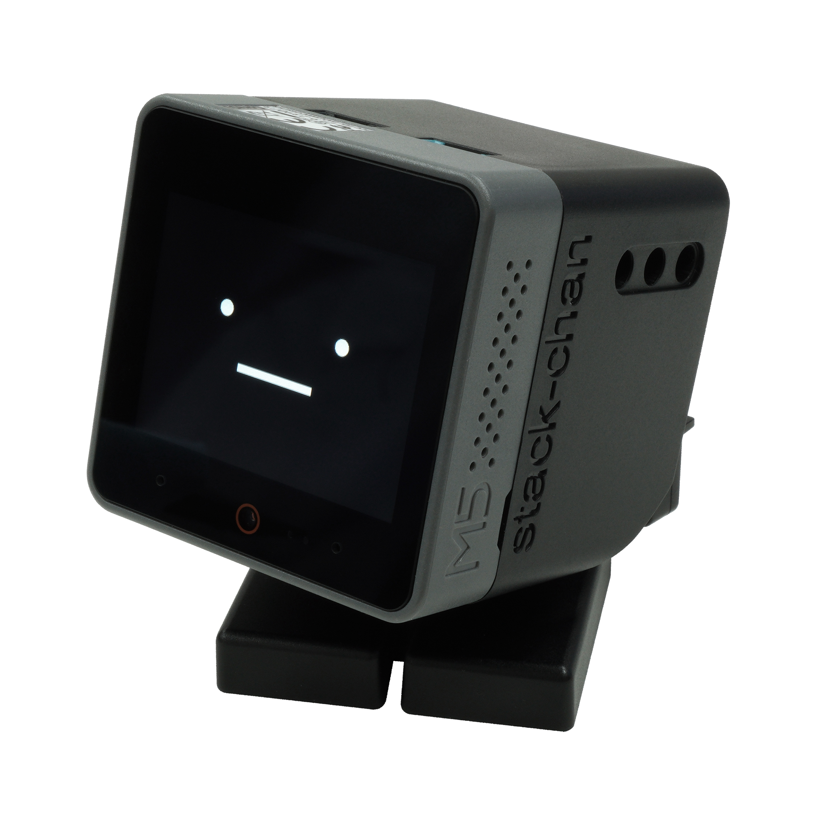

# Stack-chan RT ver.

[日本語](./README_ja.md)

This is the repository for Stack-chan RT ver.

* Official hashtag: [`#stackchan` | `#ｽﾀｯｸﾁｬﾝ` (JP)](https://twitter.com/search?q=%23stackchan%20OR%20%23%EF%BD%BD%EF%BE%80%EF%BD%AF%EF%BD%B8%EF%BE%81%EF%BD%AC%EF%BE%9D).

Stack-chan is a super cute, palm-sized communication robot developed and released in JavaScript by [Shinya Ishikawa](https://twitter.com/stack_chan).
* Project page: https://github.com/meganetaaan/stack-chan
* Video (with English subtitles): https://youtu.be/fZb_mF08xV0

 

The version includes the following changes:

* We are fixing the firmware version and the dependent Moddable SDK version to [4.1](https://github.com/Moddable-OpenSource/moddable/releases/tag/4.1)
* Some modifications have been made to the circuit diagram and the board.
* The DYNAMIXEL XL330-M288-T servo motor is adopted.
* The body is manufactured by injection molding.

## Features

* :neutral_face:     Show cute face
* :smile:            Expression(Happy, Angry, Sad etc.)
* :smiley_cat:       Customize face
* :eyes:             Glance/stare/gaze
* :speech_balloon:   Say things
* :bulb:             Addon M5Units
* :cyclone:          Drive Serial(TTL)/PWM servos
* :game_die:         Make applications on your own

## Contents

This repository includes the following contents.

* __firmware__ : Source codes of the firmware.

## Installation

### Assemble board

### Flash firmware to M5Stack

## Contribution

We accept __feature requests / bug reports__ through the [issues](https://github.com/rt-net/stack-chan/issues) page.

## License

Resources of this repository are distributed under Apache version 2.0 license.
See [LICENSE](./LICENSE).
