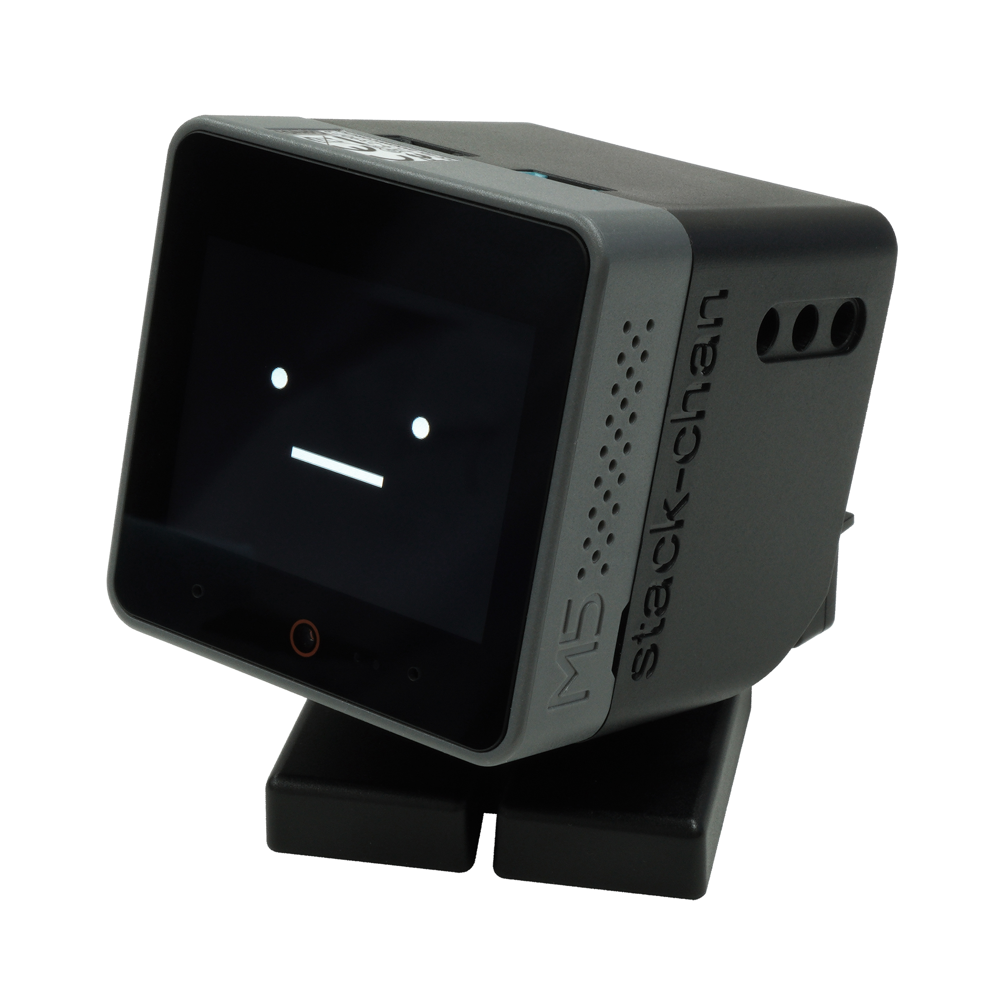

# ｽﾀｯｸﾁｬﾝ アールティver.（Stack-chan RT ver.）

[English](./README.md)

ｽﾀｯｸﾁｬﾝ アールティver. のリポジトリです。

* 公式ハッシュタグ: [`#stackchan` | `#ｽﾀｯｸﾁｬﾝ` (JP)](https://twitter.com/search?q=%23stackchan%20OR%20%23%EF%BD%BD%EF%BE%80%EF%BD%AF%EF%BD%B8%EF%BE%81%EF%BD%AC%EF%BE%9D).

ｽﾀｯｸﾁｬﾝは[ししかわ](https://twitter.com/stack_chan)がJavaScriptで開発し、公開している、手乗りサイズのｽｰﾊﾟｰｶﾜｲｲコミュニケーションロボットです。
* 作品ページ：https://github.com/stack-chan/stack-chan
* 動画: https://youtu.be/fZb_mF08xV0

 

ｽﾀｯｸﾁｬﾝ アールティver. では以下の変更が加えられています。

* ファームウェアが依存するModdable SDKのバージョンを[4.9.5](https://github.com/Moddable-OpenSource/moddable/releases/tag/4.9.5)に固定しています
* 回路図・基板を一部変更しています
* サーボモータに DYNAMIXEL XL330-M288-T を採用しています
* 本体を射出成形で製造しています

## 機能

* :neutral_face:     かわいい顔
* :smile:            感情(喜び, 怒り, 悲しみ etc.)
* :smiley_cat:       顔のカスタマイズ
* :eyes:             視線を向ける
* :speech_balloon:   喋る
* :bulb:             M5Unitを使う
* :cyclone:          シリアル(TTL)サーボを駆動する
* :game_die:         あなた自身のアプリケーションを作る

## コンテンツ

本リポジトリは以下の構成要素を含みます。

* __firmware__ : ファームウェアのソースコード

## 製作方法

### モジュールを組み立てる

[ｽﾀｯｸﾁｬﾝ アールティver. 組み立てマニュアル](docs/assembly_ja.md)を参照ください。

### ファームウェアをM5Stackに書き込む

* Windowsの場合：[Windows 11 のｽﾀｯｸﾁｬﾝ環境構築マニュアル（WSL2）](firmware/docs/getting-started-wsl2_ja.md)
* MacOS/Linuxの場合：[環境構築（MacOS/Linux）マニュアル](./firmware/docs/getting-started_ja.md)
* Webの場合：以下の手順を実行（参考：[Webブラウザからｽﾀｯｸﾁｬﾝにプログラムを書き込んでみた](https://rt-net.jp/humanoid/archives/5907)）
  1. PCから[web-flahページ](https://rt-net.github.io/stack-chan/web/flash/)にアクセス
  2. ｽﾀｯｸﾁｬﾝとPCをケーブルで接続
  3. M5Stackの下部にあるリセットボタンを3秒以上押し続けてBOOTモードに切替（切り替わるとリセットボタン付近が緑色に光ります）
  4. `M5Stack CoreS3`を選択
  5. `Flash Stack-chan firmware [・＿・]`ボタンを押下

## コントリビューション

機能追加のリクエスト/バグ報告は[issues](https://github.com/rt-net/stack-chan/issues)のページから投稿を受け付けています。

## ライセンス

このリポジトリ配下のリソースはApache version 2.0ライセンスのもと配布されています。
[LICENSE](./LICENSE)を確認してください。
