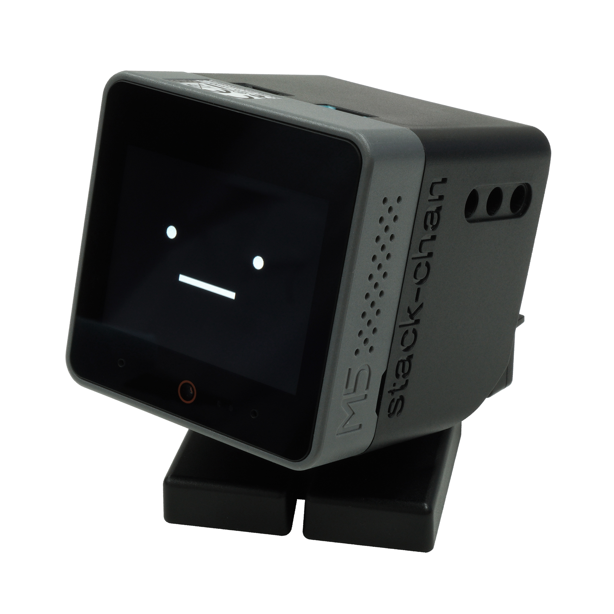

# ｽﾀｯｸﾁｬﾝ アールティver.（Stack-chan RT ver.）

[](https://github.com/meganetaaan/stack-chan/actions/workflows/build.yml)
[](https://discord.gg/eGhd9adnBm)

[English](./README.md)



ｽﾀｯｸﾁｬﾝ アールティver. のリポジトリです。

* 公式ハッシュタグ: [`#stackchan` | `#ｽﾀｯｸﾁｬﾝ` (JP)](https://twitter.com/search?q=%23stackchan%20OR%20%23%EF%BD%BD%EF%BE%80%EF%BD%AF%EF%BD%B8%EF%BE%81%EF%BD%AC%EF%BE%9D).


ｽﾀｯｸﾁｬﾝは[ししかわ](https://twitter.com/stack_chan)がJavaScriptで開発し、公開している、手乗りサイズのｽｰﾊﾟｰｶﾜｲｲコミュニケーションロボットです。
* 作品ページ：https://github.com/stack-chan/stack-chan
* 動画: https://youtu.be/fZb_mF08xV0

<br>

ｽﾀｯｸﾁｬﾝ アールティver. では以下の変更が加えられています。

* ファームウェアが依存するModdable SDKのバージョンを[4.9.5](https://github.com/Moddable-OpenSource/moddable/releases/tag/4.9.5)に固定しています
* 回路図・基板を一部変更しています
* サーボモータに DYNAMIXEL XL330-M288-T を採用しています
* 本体を射出成形で製造しています

## このリポジトリについて
このリポジトリは、アールティ版スタックチャン(Stach-chan)の機能をUIFlow2に実装したものです。

UIFlow2は、M5Stackが公式にサポートしている GUIベースのプログラミング環境です。 内部の実装は、カスタム化されたMicroPythonになっており、GUIなしでもプログラム開発を行うことができます。


## 機能

実装した機能は以下の通りです。

+ **顔のレンダリング**
    * 通常（瞬きあり）、笑い、怒り、悲しみ、ウィンク（左、右）、顔の向き（左右上下）、その他カスタマイズ可能
    
    

+ **モータ制御**
    * Dynamixel または SG90
+ **音声合成**
    * Google Text-to-speech, Voicevox(準備中)
+ **音声認識**
    * Google Speech-to-text, Vosk(独自サーバー、準備中)
+ **Webサーバ**
    * 独自実装、REST API追加可能
+ **カメラ操作**
    * Webサーバを介した画像取得


## 製作方法

### モジュールを組み立てる

[ｽﾀｯｸﾁｬﾝ アールティver. 組み立てマニュアル](docs/assembly_ja.md)を参照ください。

### ファームウェアをM5Stackに書き込む
ファームウェアは、公式サイトから提供されているUIFlow2のファームウェアをインストールしてください。

- [Core3のファームウェアインストール](https://docs.m5stack.com/ja/uiflow2/m5cores3/program)


### プログラムと設定ファイル等のアップロード
#### プログラムのアップロード
リポジトリの uiflow2/scripts/ 以下にあるPythonのプログラム（main.pyを除く）を /flash/libs の下にアップロードします。

uiflow2/scripts/main.pyを /flashの下にアップロードします。

#### 設定ファイルのカスタマイズとアップロード
設定ファイルとして以下の3つが必要です。uiflow2/conf/の下にデフォルトの設定ファイルがありますので、お使いの環境にあわせて修正してください。

- stackchan.json
- wlan.json
- apikey.txt

###### stackchan.json
スタックチャンのモータと音声認識、音声合成のサーバの設定を行います。
uiflow2/conf/stackchan.jsonには、RT版スタックチャンのための設定を記載しています。

- **motor**: "Dynamixel" または "SG90"
- **tts**: "google" または "voicevox"
- **asr**: "google"　または "vosk"

音声合成と音声認識にGoogleCloudを使わない場合には、それぞれのサーバが動作しているIPアドレスの設定が必要です。

###### wlan.json
このファイルでは、WirelessLANの接続設定を行います。
Home, Work, Mobileの3つの設定を行ってください。
プログラムの起動時に、アクセスポイントをスキャンし自動接続を行います。

```
{
    "Home": {"essid": "", "passwd": ""},
    "Work": {"essid": "", "passwd": ""},
    "Mobile": {"essid": "", "passwd": ""}
}
```
###### apikey.txt
このファイルは、GoogleCloudサービスへアクセスするためのAPIキーを設定します。
音声認識および音声合成のAPIキーは、*OPENHRI_KEY*へ記載し、GeminiへアクセスするためのAPIキーは、*GEMINI_KEY*に記載してください。
このパッケージでは、まだ、Geminiの動作検証を終えていませんが、後日、機能追加予定です。

```
OPENHRI_KEY=
GEMINI_KEY=
```

##### 設定ファイルのアップロード
stackchan.json, wlan.json, apikey.txtの3つの設定ファイルを SDカード（/sd） にアップロードしてください。

#### HTMLファイルのアップロード
このパッケージでは、Webサーバを起動します。
WebブラウザからStack-chanのIPアドレスへアクセスすると、SDカードの /sd/htmlの下にあるHTMLファイルを送信します。
サンプルとして、index.htmlとtts_sample.html, favison.ico及び js/joy.min.js がありますので、　*/sd/html* の下にコピーしてください。


以上で必要なファイルのアップロードは完了です。


## ライセンス

このリポジトリ配下のリソースはApache version 2.0ライセンスのもと配布されています。
[LICENSE](./LICENSE)を確認してください。
