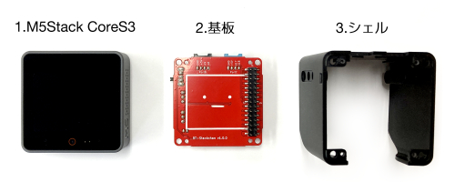
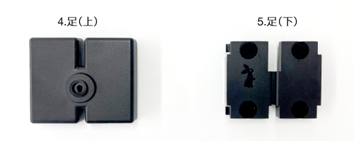
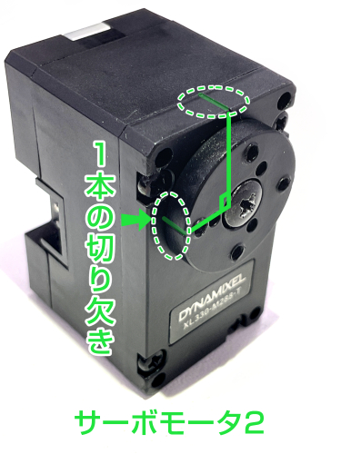
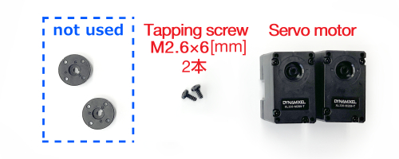
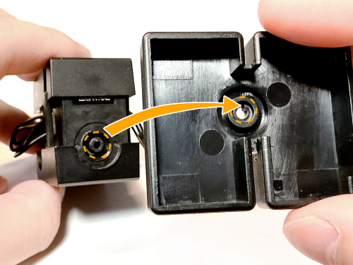
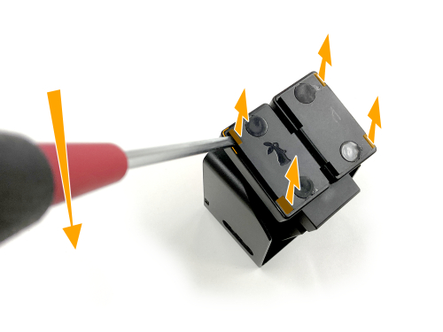
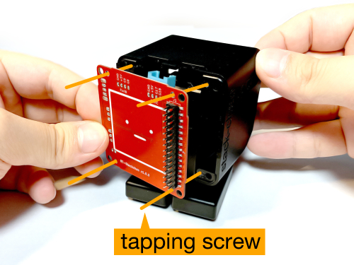

# Stack-chan RT ver. Assembley Manual組み立てマニュア

we will explain the assembly procedure for [Stack-chan RT ver.](https://rt-net.jp/products/rt-stackchan/).

## parts list

Items used for assembly.

**『[Stack-chan RT ver. Assemly kit](https://www.rt-shop.jp/index.php?main_page=product_info&products_id=4188)』 comes with two `M2.5x8[mm]` screws. These screws are not used in any steps of assembly. Please be careful not to use it incorrectly. **

### 使用パーツ

1. M5Stack CoreS3
2. Board
3. Shell(cover)
4. Feet(upper)
5. Feet(lower)
6. Servo bracket(front)
7. Servo bracket(rear)
8. Servo motor1
9. Servo motor2
10. TTL cables 2pc
11. Battery pack
12. Servo horn
13. Hex socket head tapped screws M2x5[mm] 4pc

### Optional parts

14. Hex scocket head tapped screws M3x12[mm] 2pc
15. Hex soccket head tapped screws M3x14[mm] 2pc

### Not used parts

16. Hex socket head tapped screws M2.5x8[mm] 2pc

## List of required tools

- Phillips screwdriver PH1 (for M2.6 screws)
- Flathead driver (Tip width 5.5[mm] or less)
- Hexagonal spanner 1.5[mm] (for M2 hexagon socket head screws)
- [ Optional ] Hexagonal spanner 2.5[mm] (for M3 hexagon socket head screws)

## Assembly

Assembly should be done in the following order.

### Preparing the Servo Motor

#### Adjust the angle of the circular servo horn of the servo motor.

##### Servo motor1

Rotate the circular servo horn with your finger. The **two notches on** the circular servo horn should be aligned with the notches on the servo motor 1 body.

**Notice: The bule line is an explicit illustration of the notch position and is therefore not drawn on the actual servo motor.**

##### Servo motor2

Rotate the circular servo horn with your finger so that the angle of **one notch** on the circular servo horn relative to the notch on the servo motor2 body is 90° as shown in the image.

**Notice: Unlike the servo motor1 side, the circular servo horn has a single notch. Also note that the green line is not drawn on the actual servo motor as it is an explicit illustration of the notch position.**

#### Removing screws and circular servo horn

Remove the tap screw (M2.6x6[mm]) attached to Servo motor1 and Servo motor2.

Place the removed screws in a safe place as they will be used later. The parts on the left side of the image (parts marked 'not used') will not be required to build Statck-chan RT ver.

### Assembling the body

Connect servo motor1 and servo motor2 as shown in the picture.

Servo motor1 and servo motor2 have the pre-assignatikon ID1 and ID2 respectively and are used as individual identification in the software when communicating with the M5Stack. As a marker, a blue sticker is attached to ID 1 and a green stcker to ID2. Make sure to install them correctly.

Fix the part that will become the body with servo brackets for  servo motor1 and servo motor2. Be careful not to pinch the cables, sandwich them between the servo bracket(front) and the servo bracker(rear). At this point, make sure that the lable on the servo that say's 'DYNAMIXEL XL330-M288-T' faces in the direction of the arrow.

Fix the two servo motors between the servo brackets.

### Attacjing feet

Attach the stack-chan feet to the body.

Align the protrusions of the servo motort1 with the notches in the joint of the foot(top) and press firmly to fix it in place. If the protrusions and notches are not aligned correctly, the protrusions may break when pushed in. Check carefully before pushing it in.

     

Tighten the tapped screws (M2.6x6[mm]) and secure the servo motor.

Once the screws have been tightened all the way to the back, attach the feet(bottom). Press them gently until they click.

Once the feet are attached, it should look like the image below.

#### How to detach the feet

足(上)に取り付けた足(下)は4箇所の窪みから取り外すことができます。1箇所ずつ、マイナスドライバーを窪みに差し込み、足(上)のフチを支点としたテコの原理で固定を外します。

### サーボホーンの取り付け

サーボホーンを胴体に取り付けます。

サーボモータ２とサーボホーンが共にギヤの形状となっている部分同士を取り付けます。足の取り付けの際と同様に突起と切り欠きの位置を合わせてグッと押し込んでください。

突起の位置を合わせて接合したギヤ部分にタップネジ（M2.6x6[mm]）を締めてください。

### バッテリーパックの取り付け

バッテリーパックを胴体に取り付けます。
バッテリーパックから出ている突起をサーボブラケット(後)に引っ掛けて固定します。

位置を合わせたら矢印方向にスライドしてください。

     

### 外装の取り付け

ｽﾀｯｸﾁｬﾝの外装となるシェルを取り付けます。

シェルの天板内側にある突起とサーボホーンを取り付けます。バッテリーのコードとサーボモータのTTLケーブルを前に持ってきなからスライドして入れてください。

突起によってｶﾁｯ！と手応えがあるまでスライドさせてください。

取り付けて反対側から見ると以下の画像のようになります。青色のラインはサーボホーンの輪郭です。

### 基板の取り付け

サーボモータに取り付けたTTLケーブルとバッテリーのケーブルを基板の指定した端子につなげます。

**バッテリー端子の向きに気をつけてください。間違えると故障の原因となります。**

画像の通り、基板に取り付けられた青と黒のコネクタが上になるように基板とシェルの穴の位置を合わせてネジ（六角穴付きタップネジ M2x5[mm]）を4つ締めて固定します。スライドスイッチが基板から突出しているため、シェルの側面にある穴に斜めに入れてネジの位置を合わせます。

**ネジが導体（銀色の箇所）には触れないように注意してください。バッテリの端子が接続されているためショートする恐れがあります。**

     

基板まで取り付けると以下の画像のようになります。

### M5Stack CoreS3の取り付け

M5Stack CoreS3を基板に対してピンの位置を合わせてグッと押し込んでください。

無事に取り付けられたらｽﾀｯｸﾁｬﾝの組み立ては完了です。

### 【オプション】M5Stack CoreS3の固定

M5Stack CoreS3をしっかり固定したい場合は、キットに付属している4本の六角穴付きネジで固定します。ネジの長さは２種類あるため注意してください。

バッテリーパックをサーボブラケット(後)から取り外し、バッテリーの端子も基板から外します。短いほうの六角穴付きネジM3x12[mm]の2本をｽﾀｯｸﾁｬﾝの上側に、長いほうの六角穴付きネジM3x14[mm]の2本を下側に取り付けます。4本のネジを締め終えたらバッテリーパックを再度取り付けます。

**六角ネジを取り付ける際は、必ずバッテリーを外してから取り付けてください。ネジを基板上に落とすとショートして壊れる恐れがあります。**

**必ず短い六角ネジを上側、長い六角ネジは下側に取り付けてください。間違えると液晶を壊す恐れがあります。**