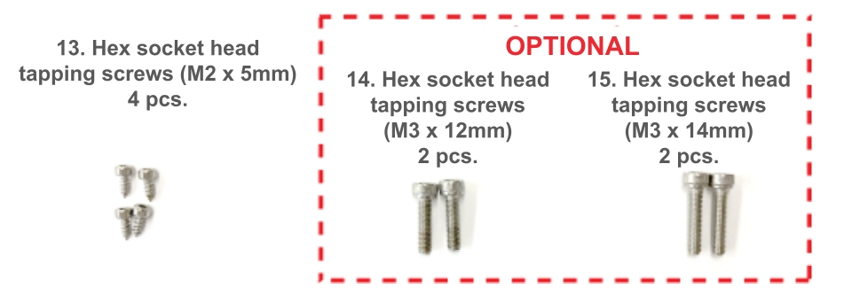
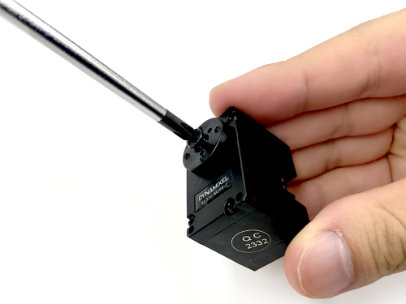
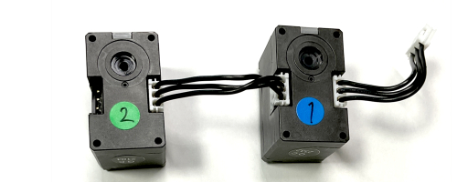
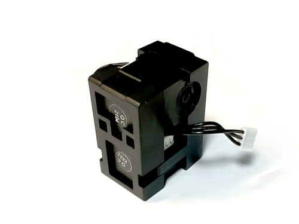
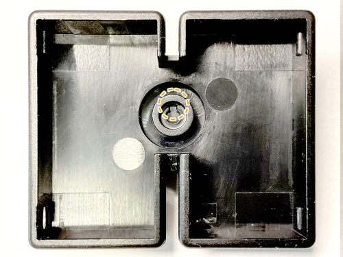
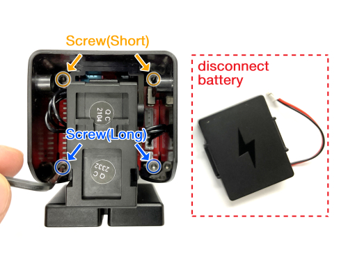

# Stack-chan RT ver. Assembly Manual

we will explain the assembly procedure for [Stack-chan RT ver.](https://rt-net.jp/products/rt-stackchan/).

## parts list

Items used for assembly.

**[Stack-chan RT ver. Assembly kit](https://www.rt-shop.jp/index.php?main_page=product_info&products_id=4188)』 comes with two `M2.5x8[mm]` screws. These screws are not used in any steps of assembly. Please be careful not to use it incorrectly.**

### Used parts

1. M5Stack CoreS3
2. Board
3. Shell(cover)
4. Feet(upper)
5. Feet(lower)
6. Servo bracket(front)
7. Servo bracket(rear)
8. Servo motor1
9. Servo motor2
10. TTL cables 2pc
11. Battery pack
12. Servo horn
13. Hex socket head tapping screws M2x5[mm] 4pc

### Optional parts

14. Hex scocket head tapping screws M3x12[mm] 2pc
15. Hex soccket head tapping screws M3x14[mm] 2pc
16. Pan head tapping screw M2.6x8[mm] 1pc

### Not used parts

17. Hex socket head tapping screws M2.5x8[mm] 2pc

## List of required tools

- Phillips screwdriver PH1 (for M2.6 screws)
- Flathead driver (Tip width 5.5[mm] or less)
- Hexagonal spanner 1.5[mm] (for M2 hexagon socket head screws)
- [ Optional ] Hexagonal spanner 2.5[mm] (for M3 hexagon socket head screws)

## Assembly

Assembly should be done in the following order.

### Preparing the Servo Motor

#### Adjust the angle of the circular servo horn of the servo motor.

##### Servo motor1

Rotate the circular servo horn with your finger. The **two notches on** the circular servo horn should be aligned with the notches on the servo motor 1 body.

**Notice: The bule line is an explicit illustration of the notch position and is therefore not drawn on the actual servo motor.**

##### Servo motor2

Rotate the circular servo horn with your finger so that the angle of **one notch** on the circular servo horn relative to the notch on the servo motor2 body is 90° as shown in the image.

**Notice: Unlike the servo motor1 side, the circular servo horn has a single notch. Also note that the green line is not drawn on the actual servo motor as it is an explicit illustration of the notch position.**

#### Removing screws and circular servo horn

Remove the tapping screw (M2.6x6[mm]) attached to Servo motor1 and Servo motor2.

Place the removed screws in a safe place as they will be used later. The parts on the left side of the image (parts marked 'not used') will not be required to build Statck-chan RT ver.

### Assembling the body

Connect servo motor1 and servo motor2 as shown in the picture.

Servo motor1 and servo motor2 have the pre-assignatikon ID1 and ID2 respectively and are used as individual identification in the software when communicating with the M5Stack. As a marker, a blue sticker is attached to ID 1 and a green stcker to ID2. Make sure to install them correctly.

Fix the part that will become the body with servo brackets for  servo motor1 and servo motor2. Be careful not to pinch the cables, sandwich them between the servo bracket(front) and the servo bracker(rear). At this point, make sure that the lable on the servo that say's 'DYNAMIXEL XL330-M288-T' faces in the direction of the arrow.

Fix the two servo motors between the servo brackets.

### Attacjing feet

Attach the stack-chan feet to the body.

Align the protrusions of the servo motort1 with the notches in the joint of the foot(top) and press firmly to fix it in place. If the protrusions and notches are not aligned correctly, the protrusions may break when pushed in. Check carefully before pushing it in.

     

Tighten the tapping screw (M2.6x6[mm]) and secure the servo motor.
If tightening the tapping screw does not firmly secure the servo motor, use the pan head tapping screw (M2.6x8[mm]) included with the product.

Once the screws have been tightened all the way to the back, attach the feet(bottom). Press them gently until they click.

Once the feet are attached, it should look like the image below.

#### How to detach the feet

Remove the feet(bottom) by detaching the feet(top) from the four depressions: one at a time, insert a flat-blade or screwdriver into the depressions and use the edge of the foot(top) as a fulcrum to release the fixing.

### Mounting the servo horn

Attach the servo horn to the body.

Attach the servo motor2 and servo horn together with the part shaped as a gear. Align the protrusions and notches in the same way as when attaching the legs and push them firmly into place.

Tighten the tapping screw (M2.6x6[mm]) in the gear section jointed by aligning the protrussions.

### Battery pack installation

Attach the battery pack to the body. Hook the protrusion from the battery pack onto the servo bracket(rear) and fix it in place.

Once aligned,slide in the direction of the arrow.

     

### Exteror fitting

Attach the shell, which serves as the exterior of Stack-chan.

Attach the projection on the inside of the top plate of the shell and the servo horn. Slide the battery cord and servo motor TTL cable in after bringing them to the front.

Click by the prongs! Slide the unit until you feel a click.

When mounted and viewed from the reversed side, you should see as shown in the image below. The blue line outline the servo horn.

### Mounting the board

Connect the TTL cable attached to the servo motor and the battery cable to the specified terminals on the board.

**Pay attention to the orientation of the battery terminals. Mistakes can cause malfunctions.**

Align the holes in the board and shell so that the blue and black connectors attached to the board are on top, as shown in the image. Tighten the four screws (hexagon sockets tap screws M2x5[mm]) to secure. As the slide switch protrudes from the board, align the screws by slanting them into the holes ub the side of the shell.

**Make sure that the screws don't touch the conductor(sliver parts). The battery terminals are connected and may short-cirduit.**

     

At this point with the circuit board installed, it should look like the image below.

### Installation of M5Stack CoreS3

Gently press the M5Stack CoreS3 into the board, aligning the pins against the board.

Once successfully installed, the stack-chan assembly is complete.

### [Optiomal] Fixing M5Stack CoreS3

If you want to secure the M5Stack CoreS3 firmly, use the four Allen screws supplied in the kit. Note that there are two different screw lengths.

Remove the battery pack from the servo bracket(rear) and disconnect the battery terminals from the board. Attach the two shorter hexagon socket head screws M3x12[mm] to the upper side of the stack-chan and the two longer hexagon socket head screws M3x14[mm] to the lower side.

**Always remove the battey before installing the hexagonal screws. Dropping the screws onto the board may cause a short circuit and damage the board.**

**Always install the short hexagonal screws on the upper side and the long hexagonal screws on the lower side. If you make a mistake, the LCD may be damaged.**
