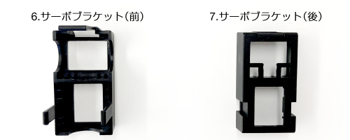
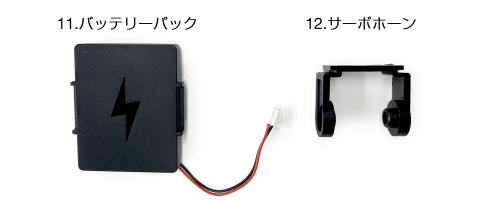
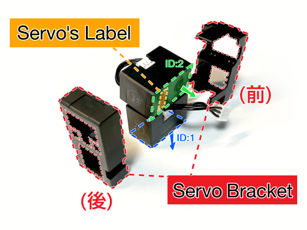
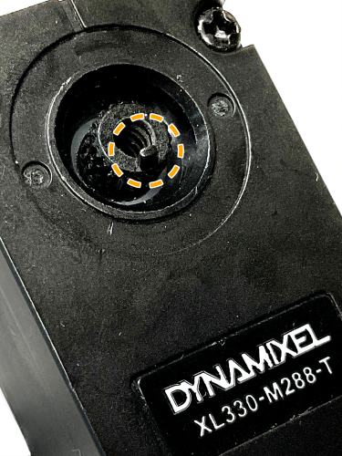
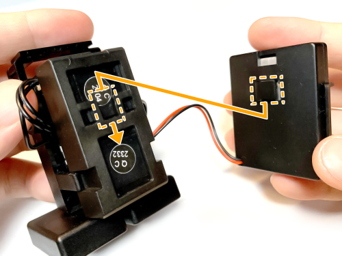
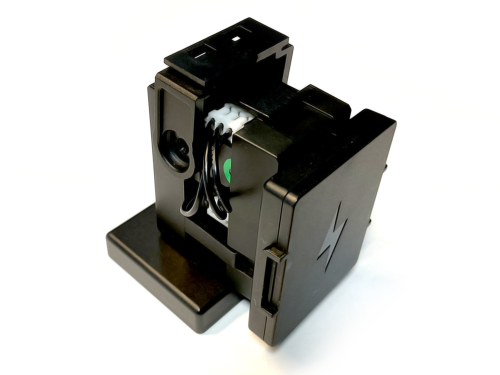
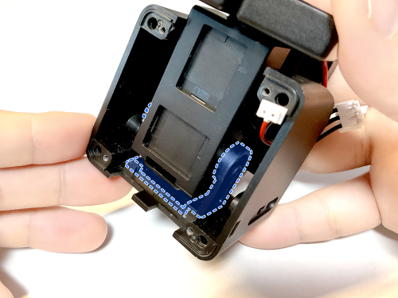
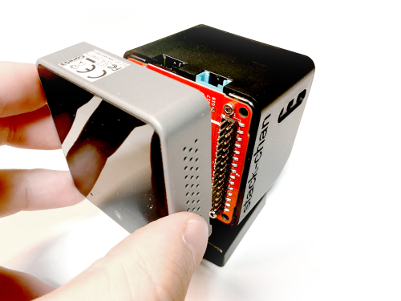
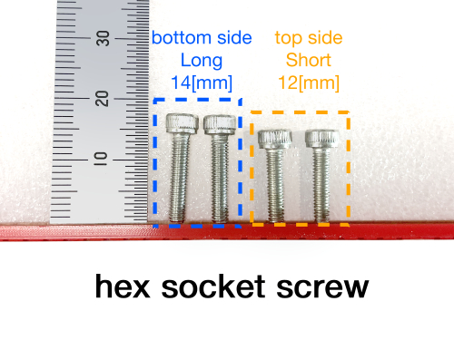

# ｽﾀｯｸﾁｬﾝ アールティver. 組み立てマニュアル

ｽﾀｯｸﾁｬﾝ アールティver.で使用するネジは6本で、それ部品の凹凸部のはめ合いで固定するスナップフィットで組み立てます。

## パーツ一覧

ｽﾀｯｸﾁｬﾝの組み立てには以下のパーツを使用します。

『[ｽﾀｯｸﾁｬﾝ アールティver. 組立キット](https://www.rt-shop.jp/index.php?main_page=product_info&products_id=4188)』には、`M2.5x8`のネジが2本が同梱されています。これらのネジは組み立てのどのステップにも使用されません。誤って使用しないよう、ご注意ください。

### 使用パーツ

1. M5Stack CoreS3
2. 基板
3. シェル
4. 足(上)
5. 足(下)
6. サーボブラケット(前)
7. サーボブラケット(後)
8. サーボモータ１
9. サーボモータ２
10. TTLケーブル 2本
11. バッテリーパック
12. サーボホーン
13. 六角穴付きタップネジ M2x5[mm] 4本

### オプションパーツ

14. 六角穴付きネジ M3x12[mm] 2本
15. 六角穴付きネジ M3x14[mm] 2本

### 不要パーツ

16. 六角穴付きネジ M2.5x8[mm] 2本

## 使用工具一覧

- プラスドライバー PH1（M2.6ネジ用）
- マイナスドライバー（先端幅5.5[mm]以下）
- 六角レンチ 1.5[mm]（M2六角穴付きネジ用）
- 【オプション】六角レンチ 2.5mm[mm]（M3六角穴付きネジ用）

## 組み立て

以下に示す順番通りに組み立ててください。

### ネジの取り外し

サーボモータ１とサーボモータ２に取り付けられたタップネジ(M2.6x6)を取り外します。

サーボモータ１：青色のシールが貼られたサーボモータ

サーボモータ２：緑色のシールが貼られたサーボモータ

取り外した2本のネジは、この後に使用するので取っておいてください。画像左側のパーツ（『not used』と書かれたパーツ）はｽﾀｯｸﾁｬﾝ アールティver.では使用しません。

### 胴体の組み立て

サーボモータ１とサーボモータ２を画像の通りに接続します。

サーボモータ１とサーボモータ２には、それぞれID1とID2が事前に割り振られており、M5Stackとの通信の際、ソフトウェア上での個体識別として用いています。目印として、ID1に青色、ID2には緑色のシールが貼られています。取り付けが逆にならないように注意してください。

胴体となる部分はサーボモータ１とサーボモータ２をサーボプラケットで固定します。ケーブルを挟まないように注意しつつ、サーボブラケット(前)とサーボブラケット(後)で挟み込みます。
この際、サーボに「DYNAMIXEL XL330-M288-T」と書いてあるラベルが矢印方向に向くようにしてください。

2つのサーボモータをサーボブラケットで挟んで固定します。

### 足の取り付け

胴体にｽﾀｯｸﾁｬﾝの足を取り付けます。

サーボモータ１の突起と足(上)の接合部の切り欠きの位置を合わせてグッと押して固定してください。突起と切り欠きの位置が正しく合っていない場合、押し込む際に突起が折れてしまう恐れがあります。慎重に確認してから押し込んでください。

     

サーボモータ用のネジ（M2.6タップネジ）を締めて固定します。

ネジを奥まで締めたら、足(下)を取り付けます。

足を取り付けると以下の画像のようになります。

#### 足の分解方法

足(上)に取り付けた足(下)は4箇所の窪みから取り外すことができます。1箇所ずつ、マイナスドライバーを窪みに差し込み、足(上)のフチを支点としたテコの原理で固定を外します。

### サーボホーンの取り付け

サーボホーンを胴体に取り付けます。

サーボモータ２とサーボホーンが共にギヤの形状となっている部分同士を取り付けます。足の取り付けの際と同様に突起と切り欠きの位置を合わせてグッと押し込んでください。

突起の位置を合わせて接合したギヤ部分にM2.6タップネジを締めてください。

### バッテリーパックの取り付け

バッテリーパックを胴体に取り付けます。
バッテリーパックから出ている突起をサーボブラケット(後)に引っ掛けて固定します。

位置を合わせたら矢印方向にスライドしてください。

    

### 外装の取り付け

ｽﾀｯｸﾁｬﾝの外装となるシェルを取り付けます。

シェルの天板内側にある突起とサーボホーンを取り付けます。バッテリーのコードとサーボモータのTTLケーブルを前に持ってきなからスライドして入れてください。

突起によってｶﾁｯ！と手応えがあるまでスライドさせてください。

取り付けて反対側から見ると以下の画像のようになります。青色のラインはサーボホーンの輪郭です。

### 基板の取り付け

サーボモータに取り付けたTTLケーブルとバッテリーのケーブルを基板の指定した端子につなげます。

バッテリー端子の向きに気をつけてください。間違えると故障の原因となります。

画像の通り、基板に取り付けられた青と黒のコネクタが上になるように基板とシェルの穴の位置を合わせてネジ（M2タップネジ）を4つ締めて固定します。スライドスイッチが基板から突出しているため、シェルの側面にある穴に斜めに入れてネジの位置を合わせます。

ネジが導体（銀色の箇所）には触れないように注意してください。バッテリの端子が接続されているためショートする恐れがあります。

    

基板まで取り付けると以下の画像のようになります。

### M5Stack CoreS3の取り付け

M5Stack CoreS3を基板に対してピンの位置を合わせてグッと押し込んでください。

無事に取り付けられたらｽﾀｯｸﾁｬﾝの組み立ては完了です。

### 【オプション】M5Stack CoreS3の固定

M5Stack CoreS3をしっかり固定したい場合は、キットに付属している4本の六角穴付きネジ（六角ネジ）で固定します。ネジの長さは２種類あるため注意してください。

バッテリーパックをサーボブラケット(後)から取り外し、バッテリーの端子も基板から外します。短いほうの六角ネジ2本をｽﾀｯｸﾁｬﾝの上側に、長いほうの六角ネジ2本を下側に取り付けます。4本のネジを締め終えたらバッテリーパックを再度取り付けます。

六角ネジを取り付ける際は、必ずバッテリーを外してから取り付けてください。ネジを基板上に落とすとショートして壊れる恐れがあります。

必ず短い六角ネジを上側、長い六角ネジは下側に取り付けてください。間違えると液晶を壊す恐れがあります。
