# Windows 11 のｽﾀｯｸﾁｬﾝ環境構築マニュアル（WSL2）

ｽﾀｯｸﾁｬﾝはWindows11、MacOS、Linuxで開発ができます。MacOS、Linuxの場合は[環境構築マニュアル（MacOS/Linux）](./getting-started_ja.md)を参照してください

`Windows11`上でｽﾀｯｸﾁｬﾝのプログラムを書き込む手順を説明します。
`Moddable`を使用したｽﾀｯｸﾁｬﾝの開発環境は`Ubuntu`OSを想定しています。`WSL2(Windows Subsystem for Linux 2)`を使用することで、`Windows`環境上で`Ubuntu`の環境を構築することができます。

## `Windows PowerShell`と`Ubuntu`の見分け方

この手順書では、`Windows PowerShell`と`Ubuntu`の２種類のウインドウを扱います。インターフェースが類似しているため間違いやすいです。以下のようにコマンド入力欄に注目すると容易に見分けられます。

- `Windows PowerShell`：コマンド入力欄の表示が`PS C:\WINDOWS\system32> `
- `Ubuntu`：コマンド入力欄の末尾の表示が`$`

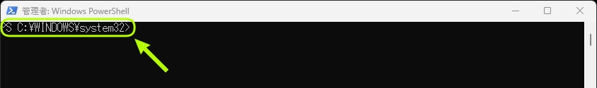

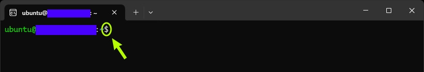

## `WSL2`+`Ubuntu22.04`のインストール

`WSL2`と`Ubuntu22.04`をインストールします。

以下の3つの手順によって、`Windows PowerShell`を管理者権限で開いてください。
1. Windowsキーを押す
2. 検索欄に「windows powershell」と入力する
3. `Windows PowerShell`のアイコンが出てくるので「管理者権限で開く」を選択してください。

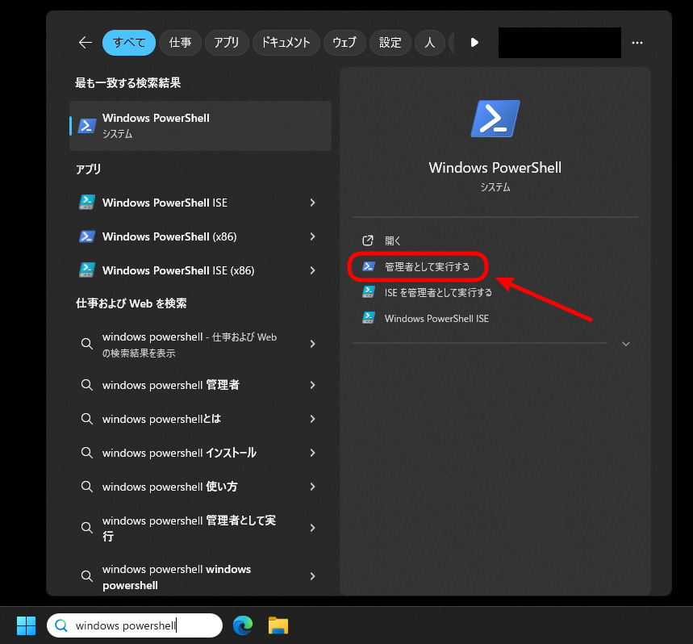

<br>

開いた`Windows PowerShell`上に、以下のコマンドを入力し、実行してください。

コマンドは画像の通り、`PS C:\WINDOWS\system32>`の後に続けて入力し、Enterキーで実行します。
```=powershell
PS C:\WINDOWS\system32> wsl --install -d Ubuntu-22.04
```

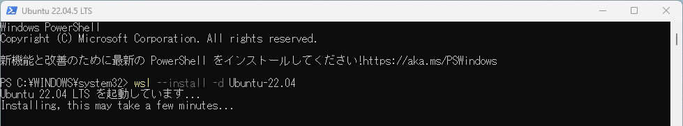

<br>
<br>

インストールが完了したら、PCを再起動してください。

PCを再起動すると、自動的に`Ubuntu`が立ち上がります。
自動で立ち上がらない場合は、以下の3つの手順によって、`Ubuntu`を開きます。（`Ubuntu`は管理者権限で起動せずに通常通りに起動してください）

1. Windowsキーを押す
2. 検索欄に「ubuntu」と入力する
3. `Ubuntu`のアイコンが出てくるので「開く」を選択してください。

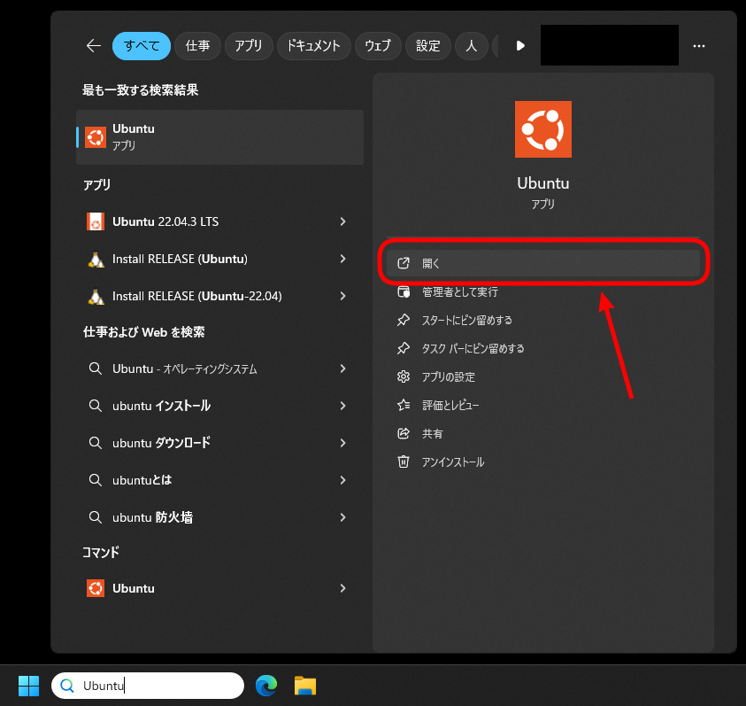

<br>
<br>

ユーザー名とパスワードの入力を求められますので任意の文字列を入力してください。
ここで入力するユーザー名とパスワードは`Windows11`のものではなく、`Ubuntu`に設定するユーザー名とパスワードです。
ユーザー名では全角文字と大文字は使用できないため、小文字のみの半角文字の文字列で設定してください。


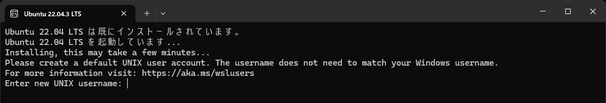

<br>
<br>

設定が完了したら`Ubuntu`を再起動します。
`Ubuntu`のウインドウ右上の`×`アイコンをクリックして閉じた後、再度スタートメニューから`Ubuntu`を選択してを起動してください。

末尾が`$`記号の文字列が表示されていればUbuntuの設定は完了です。
成功していれば、`<設定したUbuntuのユーザー名>@...:~$`表示されています。

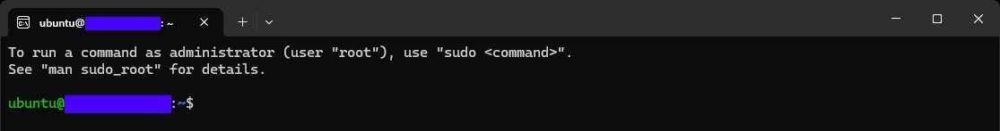

<br>
<br>

> [!WARNING]
> 
> `Ubuntu`起動時、`root@"...:~#`のように表示される場合、ユーザー作成の設定は失敗しています。
> 
> 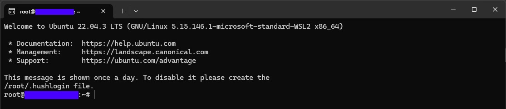
> 
> この状態に遭遇された際には本マニュアルの末尾の[最初からやり直したい場合](#最初からやり直したい場合)の節を参照し、再度Ubuntuのインストールを行ってください。

<br>

## `Ubuntu`のパッケージリストの更新と必要パッケージのインストール

`Ubuntu`にｽﾀｯｸﾁｬﾝの開発環境を構築します。
`Ubuntu`のウインドウ上で以下のコマンドを順番に入力してください。

コマンドは画像の通り、`$`の後に続けて入力し、Enterキーで実行します。

> [!IMPORTANT]
>　**`Ubuntu`では`Windows PowerShell`と違い、キーボードによるコピー&ペーストは`shift`キーも押す必要があります。**
> 
> コピー：`ctrl + shift + c`
> 
> ペースト：`ctrl + shift + v`
> 
> 特に、`ctrl + c`をUbuntu上で実行すると、プロセス（現在実行しているコマンド・プログラム）の終了となりますのでご注意ください。

<br>

### パッケージリストの更新

最新パッケージのリストを更新します。

```=bash
$ sudo apt update
```

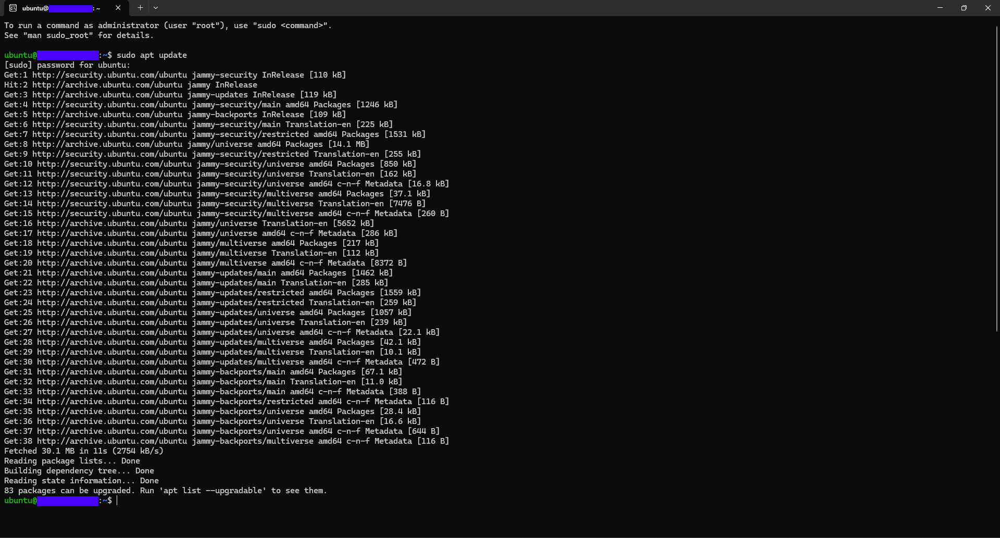

### `venv`のインストール

現在の python3 のバージョンに対応した venv パッケージをインストールします。
venv は Python の仮想環境を作成するためのツールです。

```bash
$ PYVER=$(python3 -c "import sys; print(f'{sys.version_info.major}.{sys.version_info.minor}')")
$ sudo apt install -y python${PYVER}-venv
```

### `usbutils`のインストール

USBデバイスの情報を表示するコマンドを含むパッケージ`usbutils`をインストールします。

```bash
$ sudo apt install usbutils
```

### `dialout`グループの設定

USB接続デバイスに書き込めるようにするために、現在のユーザーに必要なアクセス権限を追加します。

```bash
sudo usermod -aG dialout $(whoami)
```

## `Node.js`と`npm`のインストール

ｽﾀｯｸﾁｬﾝの開発には`Node.js`と、そのパッケージを管理する`npm`という名前のソフトウェアを使います。

`Ubuntu`のパッケージマネージャー（`apt`）から直接インストールできる`Node.js`のバージョンは古いため、`Volta`という`Node.js`のバージョン管理ツールを使って最新の安定版をインストールします。

### `Volta`のインストール

`Node.js`と`npm`を管理するツール`Volta`をインストールします。

```bash
$ curl https://get.volta.sh | bash
```

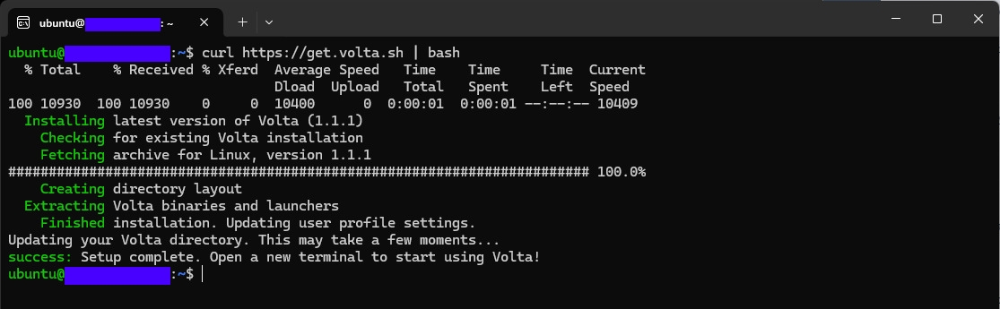

インストールに成功すると`success: Setup complete. Open a new terminal to start using Volta!`と表示され、新しいターミナルを開くように指示されますが、環境を反映するには、Ubuntuのウインドウを閉じ、Windows11のスタートメニューからUbuntuを再起動してください。

### `Volta`から`Node.js`と`npm`をインストール

`Node.js`と`npm`をインストールします。
```bash
$ volta install node@22.7.0
```

### インストールした`Node.js`と`npm`を確認

`npm`と`Node.js`がインストール出来ているかを確認します。
以下の２つのコマンドをうち、それぞれ画像の通りに表示されれば完了です。

```bash
$ npm -v
$ node -v
```

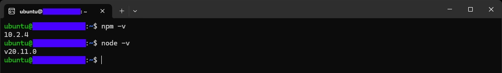

> [!CAUTION]
> 実際に表示されるバージョンは、環境をセットアップした時期によって異なります。

## ｽﾀｯｸﾁｬﾝのプログラムのインストール

### ｽﾀｯｸﾁｬﾝのプログラムのダウンロード

ｽﾀｯｸﾁｬﾝのプログラムをダウンロードします。
```bash
$ git clone https://github.com/rt-net/stack-chan.git
```

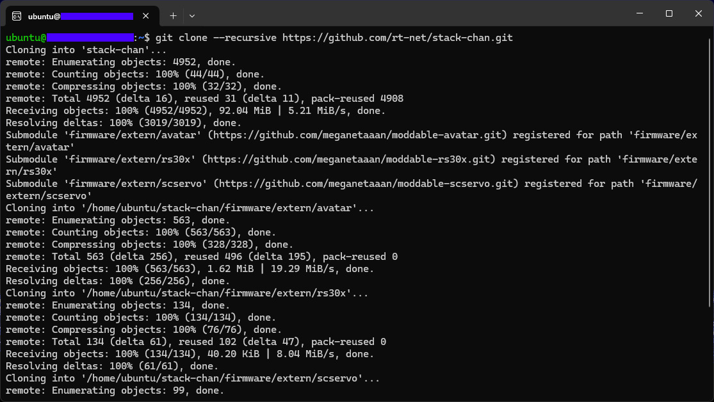

### ソフトウェアパッケージのインストール

ダウンロードしたｽﾀｯｸﾁｬﾝの`firmware`フォルダに移動し、必要なソフトウェアパッケージをインストールします。

`cd`コマンドで作業するフォルダを変更できます。

`npm install` でインストールを実行します。

```bash
$ cd stack-chan/firmware
$ npm install
```

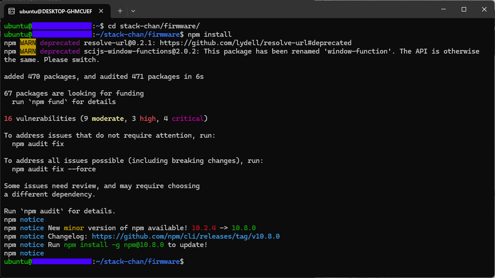

### `Moddable`のインストール

`Moddable`をインストールします。

コマンド`npm run setup`によってスクリプトを実行します。スクリプトによって、自動で`Moddable`のインストールが行われます。

以下に示す１つ目のコマンドの実行直後、`Ubuntu`に設定したパスワードの入力が要求されますので入力してください。
パスワード入力後、一定時間は同様のコマンドを実行してもパスワードは要求されません。
２つ目のコマンドでは、再度パスワードが要求されない内に実行してください。
もし、何らかの理由で１つめのコマンド実行から時間がかかってしまった場合は１つ目のコマンドの実行からやり直してください。

```bash
$ sudo echo "Temporary SuperUser Grant"
$ npm run setup
```

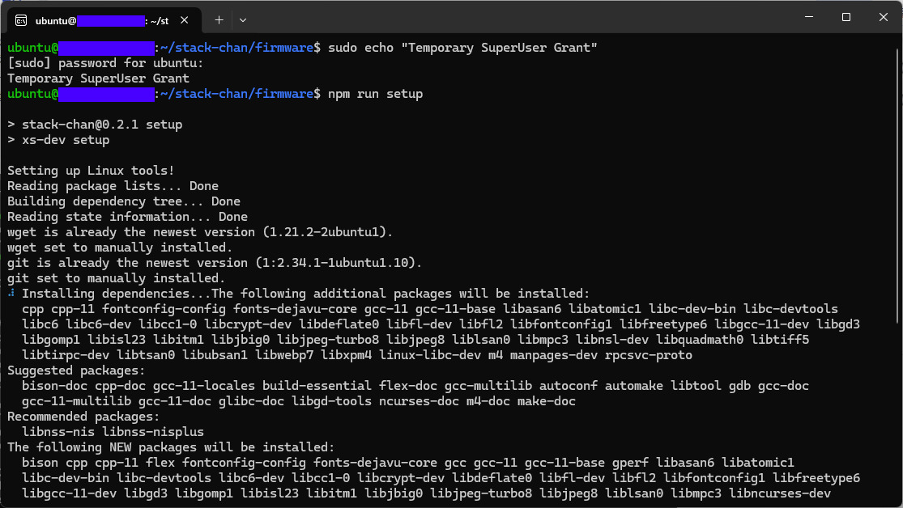

### `M5Stack`向けに`Moddable`をにセットアップ

以下のコマンドで`Moddable`の環境を`M5Stack`向けにセットアップします。
`npm run setup -- --device=esp32`はスクリプトを実行し、自動で環境のセットアップを行います。

１つ目のコマンドを実行直後、`Ubuntu`に設定したパスワードの入力が要求されますので入力してください。
パスワード入力後、一定時間は同様のコマンドを実行してもパスワードは要求されません。
２つ目のコマンドでは、このパスワードが要求されない内に実行してください。
もし、何らかの理由で１つめのコマンド実行から時間がかかってしまった場合は１つ目のコマンドの実行からやり直してください。

```bash
$ sudo echo "Temporary SuperUser Grant"
$ npm run setup -- --device=esp32
```

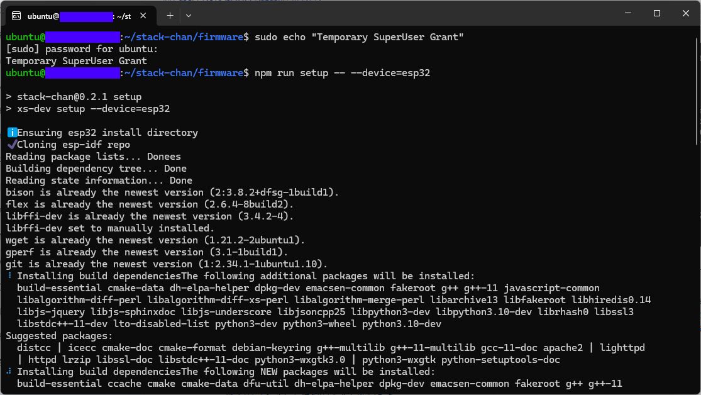

### PSRAMと環境変数のセットアップ

次のコマンドを実行して、PSRAM無効化の設定をします。

```sh
$ ./setting_scripts/unset_psram.sh
```

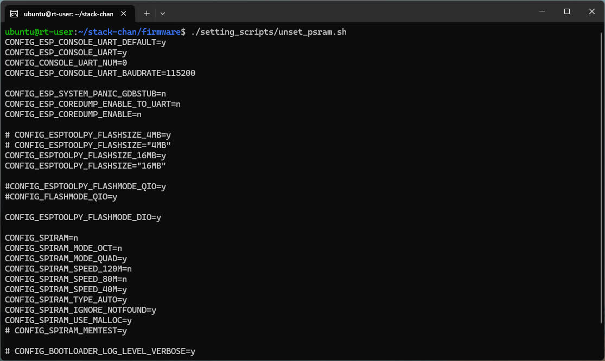


次のコマンドを実行し、Shellの設定ファイルに`source ~/.local/share/xs-dev-export.sh`を追加します。これにより、Shellの起動時に自動で環境変数が設定されるようになります。

```sh
$ ./setting_scripts/set_xs-dev_env.sh 
```

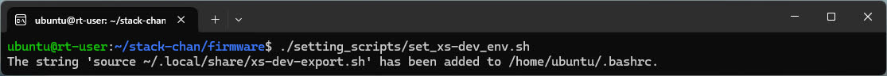


### 構築した環境の確認

Ubuntuを度再起動（Ubuntuのウインドウを閉じてから再度開く）し、以下の`cd`コマンドで作業フォルダを移動してください。

```bash
$ cd stack-chan/firmware
```

#### Moddableの環境確認

以下のコマンドでModdableの環境のテストをします。

```bash
$ npm run doctor
```

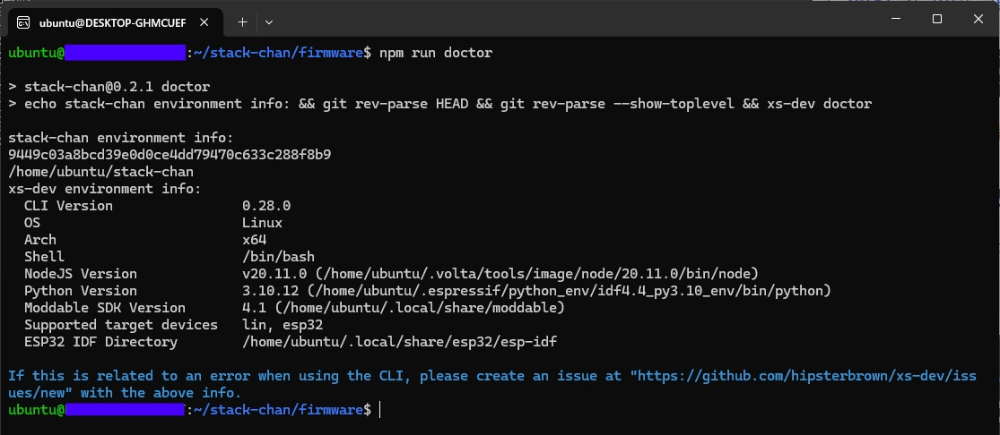

`Moddable`のバージョンが`v4.9.5`で、`ESP32 IDF Directory`のパスが正しく表示されており、`Supported target devices`が`lin, esp32`となっていれば成功です。  

#### PSRAMの環境確認

以下のコマンドでM5Stack CoreS3のPARAMの設定を確認します。

```bash
$ grep CONFIG_SPIRAM= $MODDABLE/build/devices/esp32/targets/m5stack_cores3/sdkconfig/sdkconfig.defaults
```

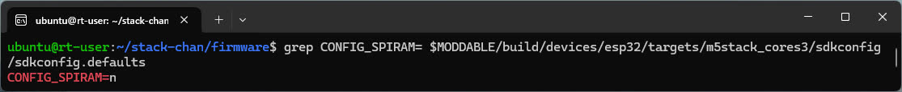


`CONFIG_SPIRAM=n`と表示されれば成功です。


ここまで完了次第、Ubuntuのウインドウを閉じてください。


## `PCのUSBポートに接続されたデバイスをWSL2上で認識できるようにする`

ｽﾀｯｸﾁｬﾝにプログラムを書き込むには、USBケーブルでPCと接続する必要がありますが、`WSL2`上ではPCのUSBポートに接続したデバイスを読み取れません。
`usbipd-win`というツールを使用することで`WSL2`上でもPCのUSBポートに接続したデバイスを認識することができます。

### `usbipd-win`のダウンロード

[公式のダウンロードページ](https://github.com/dorssel/usbipd-win/releases)から、最新版の`.msi`形式ファイルをダウンロードしてください。

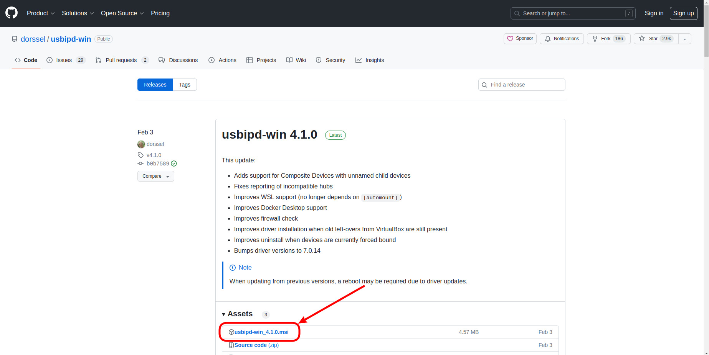

### `usbipd-win`のインストール

ダウンロードしてきたファイル（インストーラ）に従ってインストールしてください。インストールが完了したらPCを再起動してください。

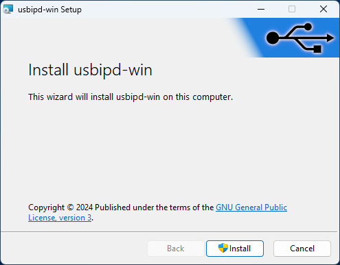

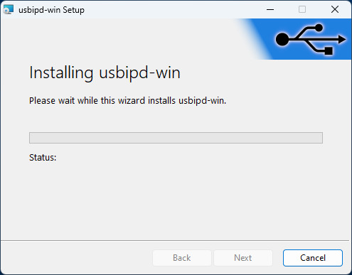

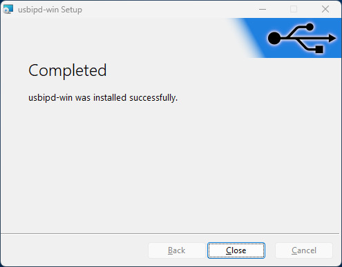

## ｽﾀｯｸﾁｬﾝをWSL2上から認識できるようにする

**`Windows PowerShell`と`Ubuntu`を両方起動します。**`Windows PowerShell`は、管理者権限で実行します。

> [!IMPORTANT]
> これ以降の手順では、**`Windows PowerShell`と`Ubuntu`の両方を起動させ続けておく必要があります。**

### `vhci_hcd`モジュールのロード

`Ubuntu`側で以下のコマンドを実行し、`vhci_hcd`モジュールをロードします。実行の際はパスワードの入力を要求されます。

```bash
$ sudo modprobe vhci_hcd
```

> [!CAUTION]
> 上記の`modprobe`コマンドは、`Ubuntu`を再起動するたびに実行する必要があります。

### `ｽﾀｯｸﾁｬﾝ`の`BUSID`を確認する

ｽﾀｯｸﾁｬﾝのBUSIDを取得します。

`Windows PowerShell`側で`usbipd list`コマンドを実行し、USBポートに接続されたデバイスリスト出力します。

```PS
PS C:\WINDOWS\system32> usbipd list
```

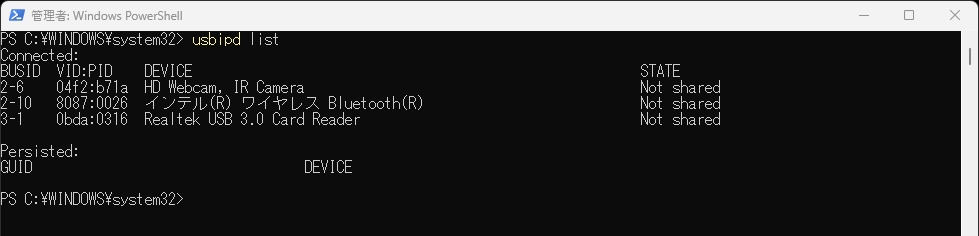

<br>
<br>

以下の手順で`ｽﾀｯｸﾁｬﾝ`とPCを接続して起動します。

1. `ｽﾀｯｸﾁｬﾝ`とPCをUSBケーブルで接続します
2. スライドスイッチを上側にスライドさせてｽﾀｯｸﾁｬﾝのバッテリー供給をONにします（同時にPCからバッテリーの充電も開始されます）
3. 起動ボタンを押して`ｽﾀｯｸﾁｬﾝ`の電源をONにします（OFFにするときは6秒間長押しします）

<p>
    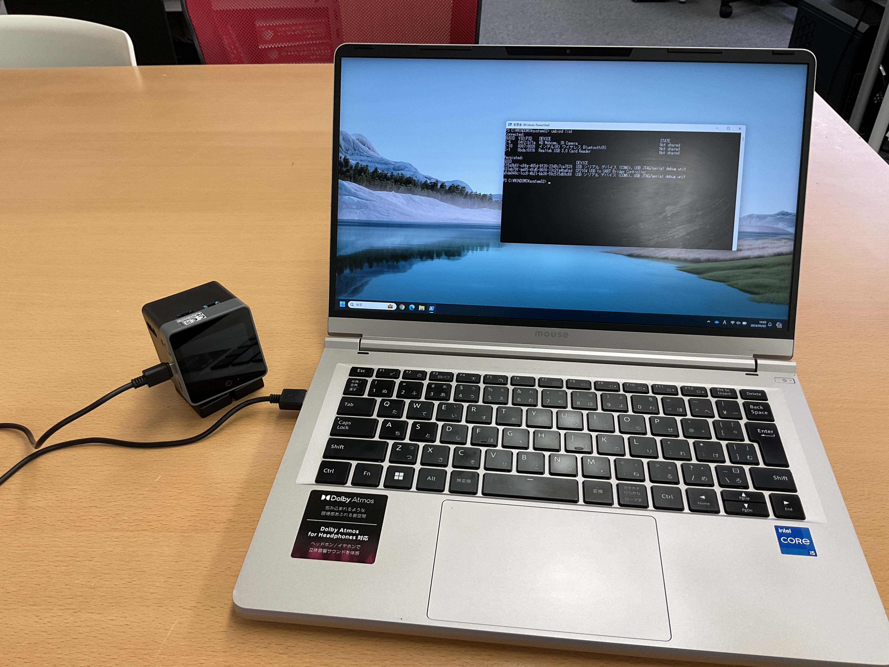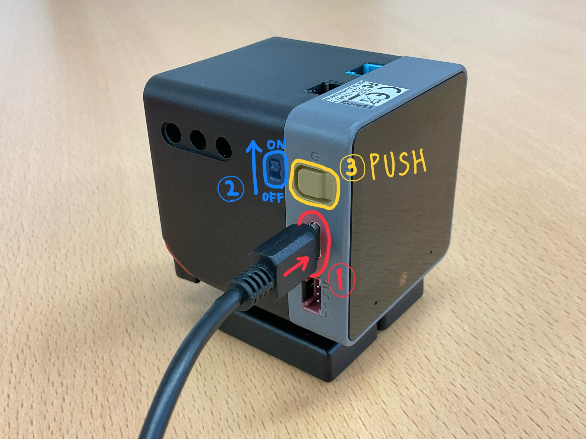
</p>

<br>

`Windows PowerShell`側で、再度`usbipd list`コマンドを実行してUSBデバイスリスト出力します。

```PS
PS C:\WINDOWS\system32> usbipd list
```

今回のコマンドで新たに現れた`BUSID`（画像の場合では`2-1`）がｽﾀｯｸﾁｬﾝを指し示してます。

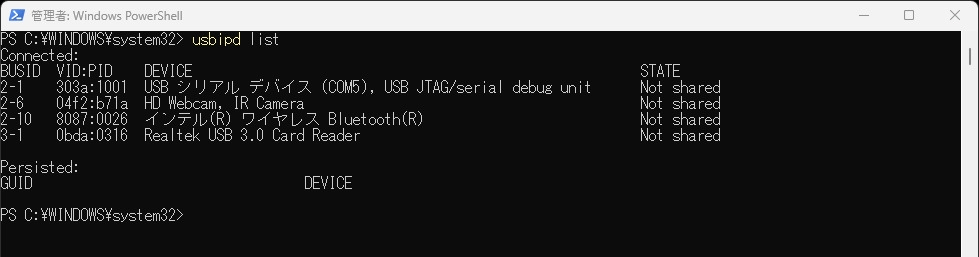

### `ｽﾀｯｸﾁｬﾝ`を`bind`する

ｽﾀｯｸﾁｬﾝを`bind`します。

`Windows PowerShell`側で、`usbipd bind`コマンドと`usbipd list`コマンドを実行します。

`usbipd bind`コマンドを実行する際は、以下に示すようにコマンドの`<ｽﾀｯｸﾁｬﾝのBUSID>`部分を自身のｽﾀｯｸﾁｬﾝの`BUSID`と置き換えて実行します。
その後、`usbipd list`コマンドを実行して再度USBデバイスリスト出力してください。

```PS
PS C:\WINDOWS\system32> usbipd bind --busid <ｽﾀｯｸﾁｬﾝのBUSID>
PS C:\WINDOWS\system32> usbipd list
```

USBデバイスリスト上のｽﾀｯｸﾁｬﾝの`BUSID`が`Shared`となっていれば完了です。

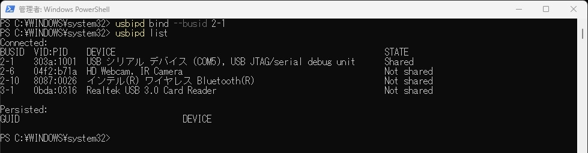

<br>

### `ｽﾀｯｸﾁｬﾝ`を`attach`する

ｽﾀｯｸﾁｬﾝを`attach`します。

以下に示すように、ｽﾀｯｸﾁｬﾝの`attach`コマンドを実行した後、再度USBデバイスリスト出力してください。

（今回も`bind`のときと同様、<ｽﾀｯｸﾁｬﾝのBUSID>`部分を自身のｽﾀｯｸﾁｬﾝの`BUSID`と置き換えて実行します。）

```PS
PS C:\WINDOWS\system32> usbipd attach --wsl --busid <ｽﾀｯｸﾁｬﾝのBUSID>
PS C:\WINDOWS\system32> usbipd list
```

USBデバイスリスト上のｽﾀｯｸﾁｬﾝの`BUSID`が`Attached`となっていれば完了です。

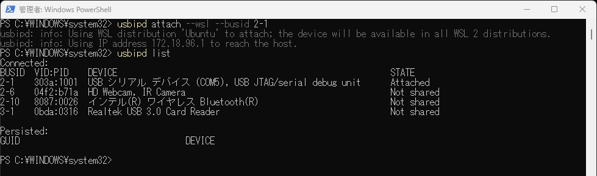

> [!CAUTION]
> 本手順は、ｽﾀｯｸﾁｬﾝとPCのUSBケーブルを再接続（挿し直し）したり、ｽﾀｯｸﾁｬﾝのリセットボタンを押すたびに再度実行する必要があります。


### `WSL2`から`ｽﾀｯｸﾁｬﾝ`を認識できていることを確認する

`WSL2`からｽﾀｯｸﾁｬﾝを認識できるかを確認します。

`Ubuntu`での作業に移ります。

`lsusb`コマンドで認識していることを確認します。
先程のPowerShell上でのｽﾀｯｸﾁｬﾝと同じ名称のデバイスが表示されています。
今回の例では、`USB JTAG/serial debug unit`です。

```bash
$ lsusb
```

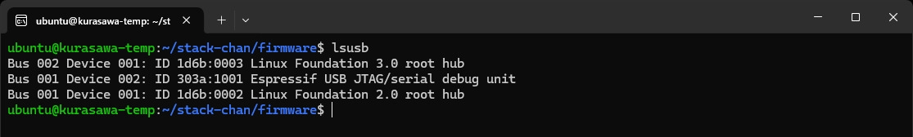

## プログラムのビルドと書き込み

ダウンロードしたｽﾀｯｸﾁｬﾝの`firmware`に移動し、プログラムのビルド・書き込みます。ビルドを行うことで、プログラムを`M5Stack`が実行できる形式に変換できます。ビルドしたプログラムをM5Stackに書き込めれば、ｽﾀｯｸﾁｬﾝを動かす手順は完了です。

先程の操作からUbuntuのウインドウを開いた状態であれば、一度再起動（Ubuntuのウインドウを閉じてから再度開く）してください。

`cd stack-chan/firmware`で作業フォルダを移動し、`npm run build --target=esp32/m5stack_cores3`コマンドを実行してビルドします。

次に、`npm run deploy --target=esp32/m5stack_cores3`を実行すればビルドしたプログラムをｽﾀｯｸﾁｬﾝに書き込めます。


```bash
$ cd stack-chan/firmware
$ npm run build --target=esp32/m5stack_cores3
$ npm run deploy --target=esp32/m5stack_cores3
```

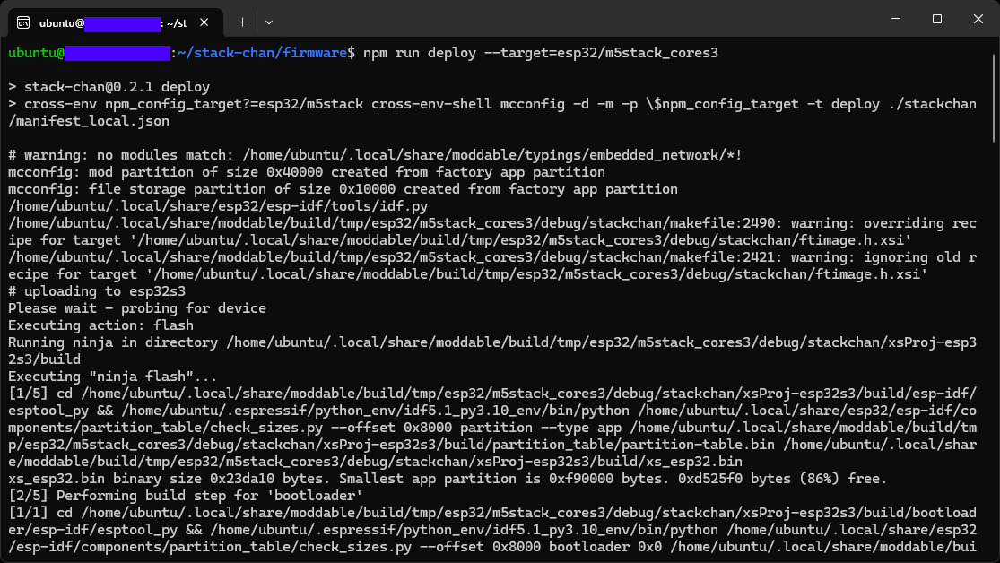

<br>
<br>

以下のように書き込みが完了次第、リセットボタンを押下してください。

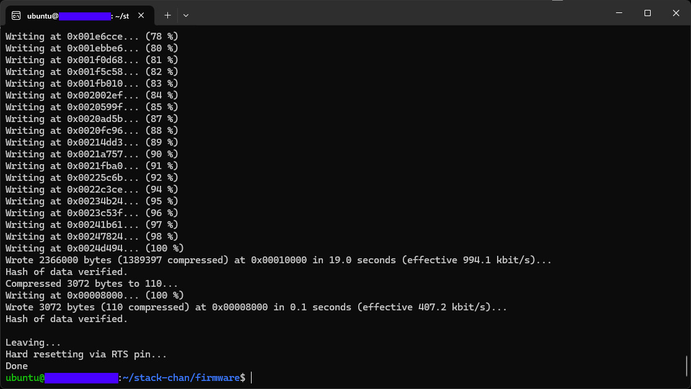

<br>
<br>

リセットボタンの位置

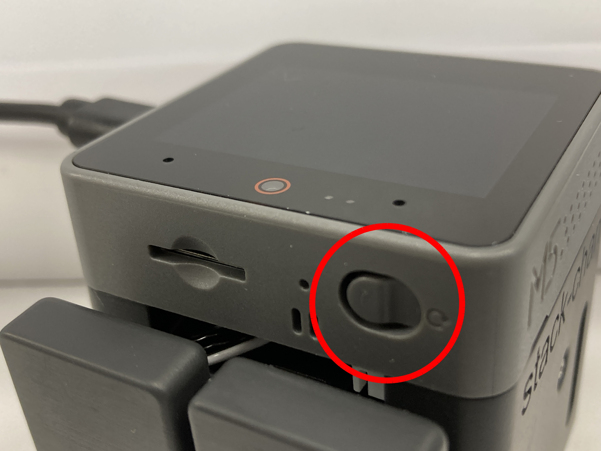

リセットボタンを押下した後にｽﾀｯｸﾁｬﾝに顔が表示されていれば書き込み完了です。

<br>

> [!CAUTION]
> **リセットボタンを押下した場合、再度プログラムを書き込むためには、[ｽﾀｯｸﾁｬﾝをattachする手順](#ｽﾀｯｸﾁｬﾝをattachする) の手順も再度実行する必要があります。**

## 最初からやり直したい場合

どこからかマニュアル通りにいかず、エラーが出力されていまった場合、エラーに従ったり調べるすることで解決に繋がります。
ですが、`Ubuntu`を一旦アンインストールし、きれいな環境で最初から実行するという手段もあります。
その場合、管理者権限で開いた`Windows PowerShell`上で以下のコマンドを実行することで現在の`Ubuntu`を削除することができます。

```PS
PS C:\WINDOWS\system32>  wsl --unregister Ubuntu
```

上記のコマンドで`Ubuntu`を削除した後、Windows11のスタートメニューから、再度`Ubuntu`を選択します。
自動で`Ubuntu`のインストールが開始され、しばらく待つとインストールが完了します。
しばらくすると`Ubuntu`インストール後の時点と同じ状態になりますので、再度構築を開始してください。


## よくある質問

### リリースファイルの有効期限エラー

WSL2とPCの設定時間がずれていると、`sudo apt update`コマンド実行の際に以下の画像のようにセキュリティ上のエラーが起きます。

`sudo apt update`コマンドの実行が完了していない場合、これ以降の手順でも失敗するため、正しく同期していることを確認してください。

```bash
$ sudo apt update
[sudo] password for ubuntu:
Get:1 http://security.ubuntu.com/ubuntu jammy-security InRelease [110 kB]
Hit:2 http://archive.ubuntu.com/ubuntu jammy InRelease
Get:3 http://archive.ubuntu.com/ubuntu jammy-updates InRelease [119 kB]
Get:4 http://archive.ubuntu.com/ubuntu jammy-backports InRelease [109 kB]
Reading package lists... Done
E: Release file for http://security.ubuntu.com/ubuntu/dists/jammy-security/InRelease is not valid yet (invalid for another 8h 24min 40s). Updates for this repository will not be applied.
E: Release file for http://archive.ubuntu.com/ubuntu/dists/jammy-updates/InRelease is not valid yet (invalid for another 8h 25min 52s). Updates for this repository will not be applied.
E: Release file for http://archive.ubuntu.com/ubuntu/dists/jammy-backports/InRelease is not valid yet (invalid for another 6h 47min 42s). Updates for this repository will not be applied.

```
